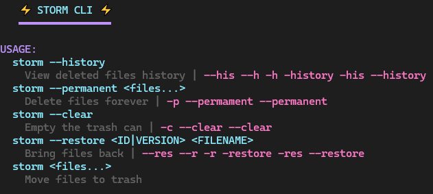
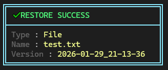

# ⚡ Storm — Don't lose your files!

## Help Command
```bash
storm
```


## Move to trash Command (Can more than one and dirs too!)
```bash
storm test.txt
```


## Restore with special version (Can more than one and dirs too!)
```bash
storm -r HISTORY_ID_OR_VERSION test.txt
```


## History Command
```bash
storm -h
```

